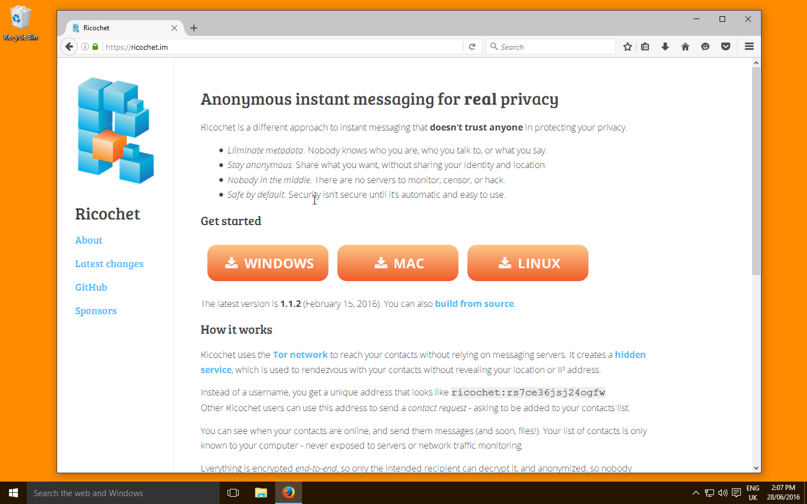

# Conversas seguras com Ricochet

[TOC]

Quando se trata de se comunicar com alguém, um problema é que ambas as partes deixam metadados para trás. No Brasil, essa informação é retida pelos provedores por um ano.

!!! **Metadados** podem ser usados para relacionar o jornalista às suas fontes

Este guia mostra a instalação do [Ricochet](https://ricochet.im?target=_blank). No fim deste guia, você terá o programa instalado no seu computador e poderá compartilhar seus contatos no Twitter para que outras pessoas possam entrar em contato contigo anonimamente. 

!!!! Ricochet opera na rede Tor de maneira descentralizada, então os metadados não são guardados em lugar nenhum

## Download do Ricochet

* Primeiro, acesse [https://ricochet.im](https://ricochet.im?target=_blank) para baixar o Ricochet

* Instale o Ricochet como qualquer outro programa

* Agora, inicie o Ricochet

* Pressione o botão _'Connect'_ para se conectar à rede Tor

!!! Tudo o que você precisa para se conectar já está dentro do Ricochet, você não precisa rodar o navegador Tor

* Espere o programa se conectar

* Uma vez que Ricochet está conectado ao Tor, uma lista de contatos aparece

* Quando a lista de contatos aparecer, clique no símbolo '**+**'. A sua Ricochet ID aparecerá na tela

## Publique seu Ricochet ID no Twitter

Você precisa publicar a sua Ricochet ID, assim outros podem te encontrar na rede. O Twitter é uma boa plataforma para publicar seu ID.

* Escreva um tweet com o seu Ricochet ID

## Como outros entrarão em contato

* A pessoa que quiser entrar em contato com você precisa do seu Ricochet ID

* A outra pessoa aperta o botão'**+**' no cliente dela e adiciona seu Ricochet ID

* Uma vez que a outra pessoa lhe adicionar à lista de contatos, a solicitação para se conectar ficará esperando

## Aceite as solicitações

* Uma janela deverá notificar você das solicitações pendentes

* Depois que a conexão for aceita, ela deverá aparecer na sua lista de contatos

* A outra pessoa verá que a solicitação foi aceita

## Trocando mensagens com Ricochet

Qualquer uma das aprtes podem agora começar uma conversa. No exemplo a seguir, a pessoa está entrando em contato com o jornalista.

* A outra pessoa clica duas vezes no seu nome de contato. Uma caixa mostra onde as mensagens podem ser escritas

* A mensagem aparecerá numa janela no seu computador

* Se você mandar algo de volta, aparecerá na outra ponta

! Ricochet não consegue enviar ou receber arquivos. Veja nossos [**guias sobre troca de arquivos**](https://privacidadeparajornalistas.org/guias#troca-de-arquivos) para encontrar técnicas apropriadas.