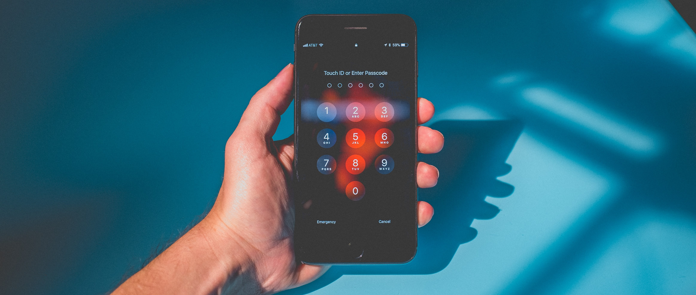

# Recuperação de contas: guia prático

[TOC]

! Este é um guia para ajudar após eventuais ataques. A parte mais importante do trabalho é a prevenção, veja o [**guia prático de higiene digital e limpeza de rastros online**](/guias/higiene-digital-e-limpeza-de-rastros-online-guia-pratico).

## Introdução

Este guia é para quando você perceber que tem algo estranho acontecendo nas suas contas **pessoais**. Talvez ligue o celular e veja uma notificação estranha de tentativa de login, ou tenha um tweet no seu perfil que não foi você quem fez, ou seus contatos do WhatsApp passaram a receber mensagens pedindo dinheiro. É possível que alguém tenha entrado em uma (ou mais) de suas contas.

Vamos te ajudar a reconquistar o acesso a sua vida digital e, seguindo algumas dicas, aumentar a segurança para o futuro.

## Passo 1: Recuperar o acesso

Se você notar alguma atividade estranha nas suas contas, a primeira coisa que você precisa fazer é garantir a segurança do seu email. Se algum invasor tiver acesso ao seu email, ele também terá a todas as outras contas vinculadas a esse serviço.

### Recuperação de email

* Google/Gmail: veja o [**guia**](https://support.google.com/accounts/answer/6294825?hl=pt-BR) ou vá diretamente para a [**página de recuperação**](https://accounts.google.com/signin/recovery);
* Yahoo: veja o [**guia**](https://br.ajuda.yahoo.com/kb/account) ou vá diretamente para a [**página de recuperação**](https://login.yahoo.com/account/challenge/username?ref=recovery&authMechanism=secondary&done=https%3A%2F%2Fwww.yahoo.com%2F&sessionIndex=Qw--);
* Microsoft/Outlook/Hotmail: veja o [**guia**](https://support.microsoft.com/pt-br/account-billing/ajuda-com-o-formul%C3%A1rio-de-recupera%C3%A7%C3%A3o-de-conta-microsoft-b19c02d1-a782-dee6-93c3-dc8113b20c42) ou vá diretamente para a [**página de recuperação**](https://account.live.com/password/reset).

[center]

[/center]

### Recuperar outras contas

Uma vez que você tenha recuperado o seu email (ou garantido a segurança dele), é a hora de olhar as outras contas. Talvez demore um pouco para conseguir o acesso novamente, dado que alguns desses serviços requerem algum tipo de prova de que a conta é realmente sua.

* Twitter: veja o [**guia**](https://help.twitter.com/pt/safety-and-security) ou vá diretamente para a [**página de recuperação**](https://twitter.com/account/begin_password_reset);
* Facebook: veja o [**guia**](https://www.facebook.com/help/231208473756221) ou vá diretamente para a [**página de recuperação**](https://www.facebook.com/login/identify/?ctx=recover&ars=facebook_login);
* Instagram: veja o [**guia**](https://help.instagram.com/374546259294234) ou vá diretamente para a [**página de recuperação**](https://www.instagram.com/accounts/password/reset/);
* Linkedin: veja o [**guia**](https://www.linkedin.com/help/linkedin/answer/56363/reporting-a-hacked-account?lang=pt) ou vá diretamente para a [**página de recuperação**](https://www.linkedin.com/uas/request-password-reset);
* Apple: veja o [**guia**](https://support.apple.com/pt-br/HT204921) ou vá diretamente para a [**página de recuperação**](https://iforgot.apple.com/).

### O que fazer se tiver o WhatsApp roubado?

Entre no aplicativo pelo seu próprio telefone e ative a conta por ali. Isso deve ser o suficiente para remover os invasores, já que o WhatsApp não fica ativo em dois telefones ao mesmo tempo.

Se não funcionar, entre em contato com a equipe de atendimento do WhatsApp, escrevendo para [**support@whatsapp.com**](mailto:support@whatsapp.com). O email pode ser enviado em português. No assunto, inclua "conta roubada" e o número de telefone em formato internacional (+55, DDD e o número). Ex.: "Conta roubada / +55 11 1234-5678".

Alerte parentes e amigos de que pode ter havido tentativas de golpes usando seu nome. Faça um BO.

Saiba mais no [**guia oficial**](https://faq.whatsapp.com/general/account-and-profile/stolen-accounts).

## Passo 2: trocar a fechadura

Se você ainda não aderiu a um gerenciador de senhas, agora pode ser uma boa oportunidade para isso. Veja algumas opções aqui.

Preferencialmente com a ajuda do gerenciador (que vai sugerir senhas fortes e únicas para cada serviço), é hora de trocar as credenciais de cada serviço:

* Email ([**Gmail**](https://support.google.com/accounts/answer/41078?co=GENIE.Platform%3DDesktop&hl=pt-br), [**Yahoo**](https://br.ajuda.yahoo.com/kb/Como-redefinir-ou-alterar-sua-senha-do-Yahoo-sln27051.html), [**Outlook (Hotmail)**](https://support.microsoft.com/pt-br/office/alterar-sua-senha-no-outlook-com-2138d690-811c-4545-b2f3-e4dbe80c9735))
* Google ([**É a mesma do Gmail ;)**](https://support.google.com/accounts/answer/41078?co=GENIE.Platform%3DDesktop&hl=pt-br))
* Apple ([**Gerencie seu ID Apple**](https://appleid.apple.com/account/manage))
* Facebook ([**Segurança e login**](https://www.facebook.com/settings?tab=security))
* Instagram ([**Alterar senha**](https://www.instagram.com/accounts/password/change/))
* Twitter ([**Altere sua senha**](https://twitter.com/settings/password))
* Reddit ([**Atualizar sua senha**](https://www.reddit.com/prefs/update/))
* PayPal ([**Password Change**](https://www.paypal.com/myaccount/security/password/change))

## Passo 3: fechar a porta

Agora, você já recuperou os acessos às contas e trocou a senha, mas talvez o atacante ainda esteja logado no seu perfil. Muitos serviços permitem remover todos os dispositivos conectados --essa é a opção mais segura, mas, sim, você precisará entrar em tudo de novo.

### Saia de todas as sessões ativas

* Google: a "[**Verificação de segurança**](https://myaccount.google.com/security-checkup/)" permite remover as sessões ativas em "Seus dispositivos" e revisar as "Atividades de segurança recentes" para checar inconsistências;
* Yahoo: veja a "[**Atividade da Conta**](https://login.yahoo.com/account/activity)" e clique em sair de todas as outras sessões;
* Twitter: clique no botão "sair de todas as outras sessões" em "[**Sessões Ativas**](https://twitter.com/settings/sessions)";
* Instagram: abra cada sessão e clique em "log out" em "[**Atividade de login**](https://www.instagram.com/session/login_activity/)";
* Facebook: em "Onde você se conectou", dentro de "[**Segurança e Login**](https://www.facebook.com/settings?tab=security)", clique em "ver mais" e "sair de todas as sessões".
* LinkedIn: cheque "[**Suas sessões ativas**](https://www.linkedin.com/psettings/sessions)" e clique em "Sair de todas as sessões".
* Apple: remova todos os dispositivos desconhecidos, saiba como no [**guia**](https://support.apple.com/pt-br/HT205064).
* WhatsApp: veja o guia de como [**desconectar os todos os aparelhos**](https://faq.whatsapp.com/web/download-and-installation/how-to-log-in-or-out).

### Veja os dados de recuperação

Na sequência, veja suas configurações de recuperação --ou seja, qual contato usarão caso um incidente aconteça novamente. Certifique-se de que você reconhece e tem acesso a tanto o email quanto o telefone listados. Remova dados antigos ou não reconhecidos e aproveite para atualizar a informação.

* Google: veja a parte de "Maneiras de verificar sua identidade" na tela de [**segurança**](https://myaccount.google.com/security);
* Yahoo: altere o email e/ou o telefone no [**painel de segurança**](https://login.yahoo.com/account/security);
* Twitter: veja "[**Informações da conta**](https://twitter.com/settings/your_twitter_data/account)" nas configurações;
* Instagram: veja "[**Editar perfil**](https://www.instagram.com/accounts/edit/)";
* Facebook: veja as "[**Configurações móveis**](https://www.facebook.com/settings?tab=mobile)" (número de telefone) e [**Configurações gerais da conta**](https://www.facebook.com/settings?tab=account) (email);
* LinkedIn: veja a tela de "[**acesso à conta**](https://www.linkedin.com/psettings/sign-in-and-security)", em "Acesso e segurança", e confira tanto o email quanto o telefone;
* Apple: veja as [**configurações**](https://appleid.apple.com/account/manage) da conta.

### Limpe os aplicativos com acesso

Feito isso, é hora de ver quais são os serviços de terceiros que têm acesso a sua conta. É bem comum que aplicativos tenham acesso a suas contas do Google ou Facebook, por exemplo, mas é bom sempre limpar os que não estão sendo usados. Veja as seguintes páginas e remova tudo o que não usa ou não reconhece:

* Google: [**Apps com acesso a sua conta**](https://myaccount.google.com/permissions);
* Twitter: [**Aplicativos conectados**](https://twitter.com/settings/connected_apps);
* Instagram: [**Aplicativos e sites**](https://www.instagram.com/accounts/manage_access/);
* Facebook: [**Aplicativos e sites**](https://www.facebook.com/settings?tab=applications&ref=settings);
* LinkedIn: [**Serviços autorizados**](https://www.linkedin.com/psettings/permitted-services);
* Apple: [**Gerenciar apps e sites**](https://appleid.apple.com/account/manage), ou veja o [guia](https://support.apple.com/pt-br/HT210426).

## Passo 4: aumente a segurança

Uma vez que a ordem foi restabelecida, é importante certificar-se que você tem [**autenticação de múltiplos fatores**](/guias/higiene-digital-e-limpeza-de-rastros-online-guia-pratico#passo3configuraesdeprivacidadeea-...) também. A ideia agora é adicionar uma camada extra de segurança às contas para dificultar que esse problema ocorra novamente. Vale também para o [**WhatsApp**](https://faq.whatsapp.com/general/verification/about-two-step-verification?category=5245245).

<iframe width="560" height="315" src="https://www.youtube-nocookie.com/embed/amMyHuPor-Q" title="YouTube video player" frameborder="0" allow="accelerometer; autoplay; clipboard-write; encrypted-media; gyroscope; picture-in-picture" allowfullscreen></iframe>

### Aproveitando

O Facebook e o Google possuem sistemas de check-up de segurança e privacidade para revisar algumas das configurações mais comuns. É bom dar uma olhada vez ou outra por ali pra garantir que você está confortável com as definições:

* [**Check-up de segurança do Google**](https://myaccount.google.com/security-checkup);
* [**Verificação de privacidade do Facebook**](https://www.facebook.com/privacy/checkup/?source=settings_and_privacy).

## Saiba mais

Fale comigo: Raphael Hernandes (Rapha) - por [**email**](mailto:r@privacidadeparajornalistas.org) ou no [**Twitter**](https://twitter.com/hernandesraph).

Agradecimentos a [Sean Sposito](https://twitter.com/seansposito), de [The Paranoids](https://twitter.com/TheParanoids), pela orientação ao construir este guia.

Mais informações sobre cibersegurança e guias avançados: [**Privacidade para Jornalistas**](/)

* Privacidade para Jornalistas: [**guia prático de higiene digital e limpeza de rastros online**](/guias/higiene-digital-e-limpeza-de-rastros-online-guia-pratico)
* Google: [**Proteger uma Conta do Google invadida ou comprometida**](https://support.google.com/accounts/answer/6294825?hl=pt-BR)
* Apple: [**Se você acha que seu ID Apple foi comprometido**](https://support.apple.com/pt-br/HT204145)
* Facebook: [**Eu acho que minha conta do Facebook foi invadida ou alguém a está usando sem minha permissão**](https://www.facebook.com/help/203305893040179)
* Twitter: [**Ajuda para minha conta comprometida**](https://help.twitter.com/pt/safety-and-security/twitter-account-compromised)
* LinkedIn: [**Como denunciar uma conta invadida**](https://www.linkedin.com/help/linkedin/answer/56363/reporting-a-hacked-account)
* WhatsApp: [**Como recuperar sua conta**](https://faq.whatsapp.com/general/account-and-profile/stolen-accounts)

Cabeçalho: Photo by [NeONBRAND](https://unsplash.com/@neonbrand?utm_source=unsplash&utm_medium=referral&utm_content=creditCopyText) on [Unsplash](https://unsplash.com/s/photos/cybersecurity?utm_source=unsplash&utm_medium=referral&utm_content=creditCopyText).

No texto: Photo by [Miha Arh](https://unsplash.com/@arhmi?utm_source=unsplash&utm_medium=referral&utm_content=creditCopyText) on [Unsplash](https://unsplash.com/s/photos/lock?utm_source=unsplash&utm_medium=referral&utm_content=creditCopyText).
  