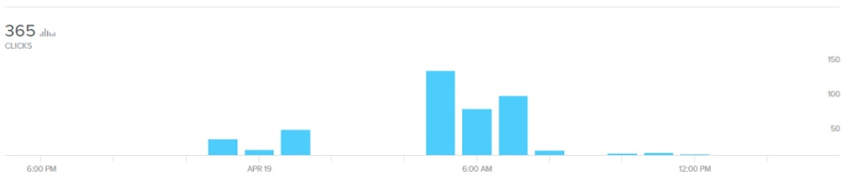

# Phishing nas redações

!!! **_Phishing_** (variação do termo em inglês 'fishing', pescaria) é um tipo de fraude que um golpista usa para tentar obter dados de um usuário. Muitas vezes são enviados emails e páginas falsas para a vítima, como uma que simule o site de um banco. Ao tentar fazer login, o cliente teria suas informações roubadas. Esse é um caso simples, mas as abordagens dos criminosos são variadas e cada vez mais sofisticadas

fraude por meio da qual um golpista tenta obter dados pessoais e financeiros de um usuário, pela utilização combinada de meios técnicos e engenharia social

Quem é que ainda cai em _phishing_? Muita gente. É sério.

O _phishing_ se tornou uma espécie de tabu virtual. Ninguém gosta de admitir que está suscetível a essa ameaça, mas o problema é mais comum do que imaginamos. Veja este tweet do pesquisador de segurança da Kaspersky Fábio Assolini como exemplo: 

[plugin:embed](https://twitter.com/assolini/status/903265401643118594)

Um monte de usuários desavisados? Talvez.

A verdade é que nem todas as tentativas de golpe que recebemos por email são como aquela da viúva de um príncipe nigeriano que quer nos deixar uma fortuna. Os ataques são cada vez mais sofisticados e podem ser voltados a um alvo específico (como em casos de _spear phishing_).

!!! **_Spear-phishing_** ('pesca com arpão') é uma [modalidade popular do golpe](https://www.firmex.com/thedealroom/spear-phishing-whos-getting-caught/), que mira em um alvo específico e faz mensagens personalizadas para ele. Criminosos chegam a observar a vítima por dias, de modo a serem o mais assertivos possíveis ao enganar, e podem simular um email enviado por uma pessoa próxima

Por isso, analisamos uma mensagem que foi especificamente criada para atacar redações. O resultado? 

Em menos de 12h, foram 365 cliques na URL maliciosa (_um deles foi meu, em ambiente seguro, para fazer esse teste_).

Temos também casos relatados de órgãos de imprensa hackeados no Brasil e no exterior após um email de phishing. 

Em 2013, por exemplo, a Associated Press e a BBC [foram vítimas](http://www.bbc.com/news/world-middle-east-22287326) de um ataque. Como consequência, a agência de notícias twittou uma falsa informação "urgente" dizendo que explosões na Casa Branca teriam ferido o ex-presidente dos EUA Barack Obama. No caso da emissora britânica, também no Twitter, foram postadas mensagens a favor de Bashar al-Assad.

Isso sem falar dos [altos números de incidentes](https://www.cert.br/stats/) registrados pelo CERT.BR. Ou de [estudo da Kaspersky](https://securelist.com/spam-and-phishing-in-q2-2017/81537/) que coloca o Brasil no [topo do ranking de quem mais sofre _phishing_ desde 2015](http://www1.folha.uol.com.br/tec/2017/08/1912528-brasileiro-e-quem-mais-sofre-fraudes-na-internet.shtml). 

A [ameaça](https://privacidadeparajornalistas.org/ameacas) existe e pode trazer grandes problemas. Veja algumas dicas para se proteger.

!!!! Será que você cairia em um email de _phishing_? A empresa de segurança digital SonicWall [criou um quiz](https://www.sonicwall.com/en-us/phishing-iq-test) para os usuários avaliarem se uma mensagem é uma tentativa de _phishing_ ou um email legítimo

## Proteção