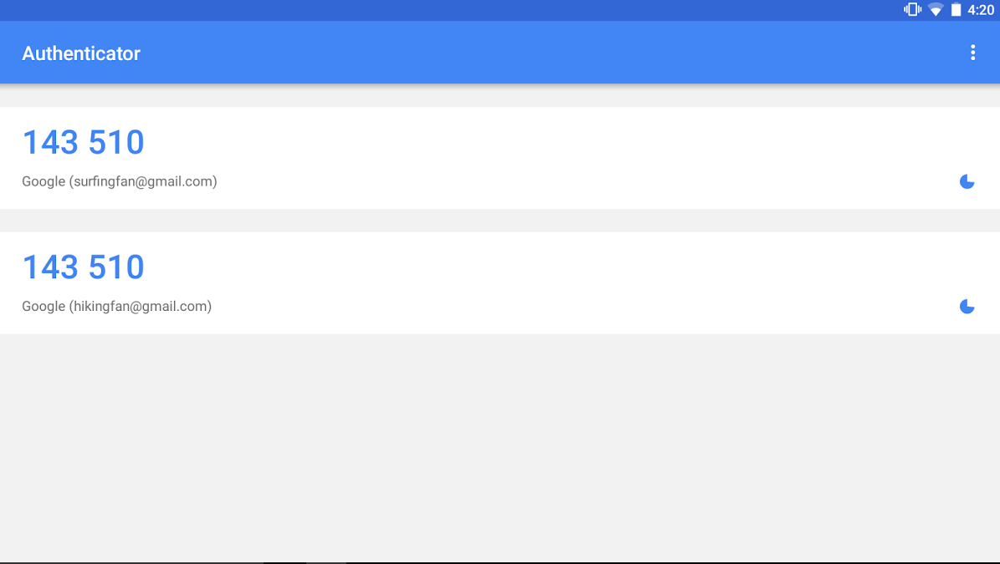
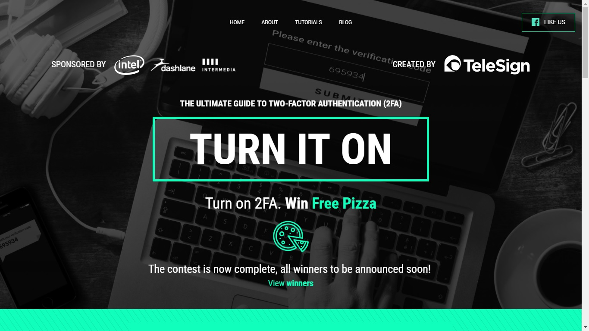

E se alguém descobrisse a senha do seu email? Quão exposto você estaria? E suas fontes?

As consequências de um caso como esse podem ser nefastas. Ainda mais se considerarmos que muitos usam a mesma senha para diversos serviços (o que, por si só, já não é nada recomendável). 

A boa notícia é que existe uma forma simples para elevar o nível de segurança de serviços protegidos por senha, e você provavelmente já usa algo parecido: a autenticação (ou verificação) em duas etapas, também chamada de 2FA.

!!! Autenticação e verificação em duas etapas são dois nomes para a mesma medida 

A 2FA é uma camada extra de segurança, após o uso da senha. Sabe quando você vai acessar a conta do banco e tem que pegar um número de _token_ no celular depois de digitar a senha? É isso.

Essa mesma técnica é usada (gratuitamente) em muitos serviços diferentes para aumentar a segurança, entre eles emails, redes sociais e sistemas de armazenamento em nuvem. 

Com o uso de 2FA, mesmo se alguém descobrir sua senha, a conta não estará exposta. Isso porque o possível invasor não terá acesso direto ao sistema. Precisaria passar por essa segunda barreira também.

Na prática, a forma de autenticação varia. Tem serviços que mandam um SMS com um código a mais, que precisa ser inserido  como se fosse uma senha. Outros (muito mais seguros, a propósito), podem ser agregados num aplicativo gratuito que reúne todos esses _tokens_ de acesso, que se renovam a cada poucos segundos. Exemplos são o [Authy](https://authy.com/) e o Google Authenticator (disponível para [Android](https://play.google.com/store/apps/details?id=com.google.android.apps.authenticator2&hl=pt_BR) e [iOS](https://itunes.apple.com/br/app/google-authenticator/id388497605), demonstrado na imagem abaixo). Há ainda alguns que simplesmente mandam uma notificação no seu celular pedindo aprovação.

E se eu perder o celular, ou estiver sem sinal? A maioria dos serviços oferece também alternativas para esses casos, cada um da sua forma. O Facebook, por exemplo, traz a opção de se logar a partir de uma lista de códigos pré-definidos que podem ser imprimidos (pensando no caso de você viajar sem telefone). 

!! O uso de 2FA não deixará sua conta invulnerável e [outras medidas de segurança](https://privacidadeparajornalistas.org/guias) são sempre bem-vindas. Há formas de se invadir uma conta mesmo com o uso de autenticação em dois fatores, uma dessas maneiras está [descrita neste podcast](https://gimletmedia.com/episode/97-what-kind-of-idiot-gets-phished/) da Gimlet Media (em inglês)

## Como ativar

Para ativar a 2FA, normalmente basta ativar a função dentro do serviço (Gmail, por exemplo) e depois escanear um código QR dentro de um app como o Google Authenticator.

A questão é que as etapas variam um pouco de serviço para serviço. Convenientemente, o site [_Turn On 2FA_](https://www.turnon2fa.com/) reuniu uma série de tutoriais explicando como ativar a função em vários lugares diferentes.

Basta usar a caixa de busca no site e seguir os passos indicados. 

Vai dar um pouco mais de trabalho acessar aquele site que você usa todos os dias? Vai, mas garanto que vale a pena ;)

###### > _[Raphael Hernandes](https://twitter.com/rhhernandes) escreveu esse post e gasta alguns segundos a mais toda vez que vai fazer login em algo, porque usa 2FA_