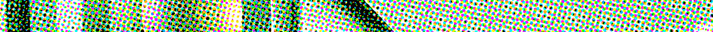

### Proteja suas fontes

**Privacidade para Jornalistas** ajuda repórteres no Brasil a protejer suas fontes de:

* Coleta e retenção de metadados
* Vigilância
* Hacking

> "Com essas leis de metadados você pode ver imediatamente quem jornalistas estão contatando, de onde você pode deduzir quem são suas fontes." - **Edward Snowden** [9 de maio de 2015](http://www.abc.net.au/news/2015-05-08/edward-snowden-says-australias-mass-surveillance-dangerous/6456938?target=_blank)

#### Fornecemos à comunidade de jornalistas

* [Análise de Ameaças](/threat-modeling-for-journalists): Para ajudar jornalistas a entender seus adversários e motivações;
* [Guias práticos](/guides): Para defender os dados de jornalitas e suas fontes baseado na análise de ameaças mencionada acima;
* [Links úteis](/useful-links): Uma coleção de várias dicas de segurança, legislação, grupos e associações que visam defender a privacidade;
* [Comunidade](/community): Para discutirmos as melhores práticas;
* [Wiki](https://wiki.privacyforjournalists.org.au): Legislação sobre metadados e vários guias de tecnologia. Todos são convidados a contribuir.